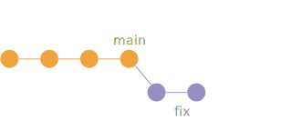
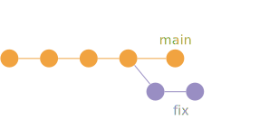
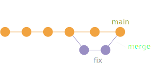
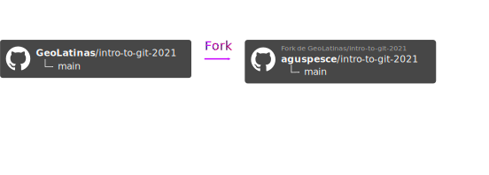
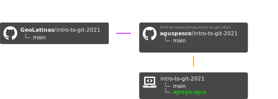
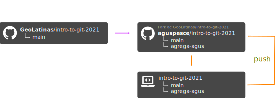

<!-- .slide: class="slide-title" -->

<h1 class="menu-title">Introducción a Git y Github</h1>

## [Agustina Pesce](https://aguspesce.github.io)<sup>1,2</sup> y [Mariana Gómez](https://github.com/MGomezN)<sup>3</sup>

<sup>1</sup>[*CONICET, Argentina*](https://www.conicet.gov.ar/)
<br>
<sup>2</sup>[*Instituto Geofísico y Sismológico Volponi, UNSJ, Argentina*](http://igsv.unsj.edu.ar/)
<br>
<sup>3</sup>*Centro de Investigación Científica y de Educación Superior de Ensenada, Baja California (CICESE), México*

<div class="logo">
<a href="https://geolatinas.weebly.com/">

</a>
</div>

---

<h1 class="menu-title"> Información </h1>

- **Cuándo:** [Sábado 27 de noviembre 2021 de 15:00 a 19:00 GMT](https://www.timeanddate.com/worldclock/fixedtime.html?msg=Introduccion+a+Git&iso=20211204T12&p1=1078&ah=4)
- **Notas colaborativas:** Etherpad: https://pad.disroot.org/p/2o7i0afvxpe8jcdy
- **Material:**  https://swcarpentry.github.io/git-novice-es
- **Diapositivas:**  https://geolatinas.github.io/intro-to-git-2021

---

## Requisitos

1. Terminal
2. Instalar Git
3. Editor de texto
4. Tener una cuenta en GitHub
5. Llenar formulario de registro al taller

No es necesario tener experiencia en el uso de la terminal

---

<h1 class="menu-title"> Objetivos </h1>

- Gestionar versiones con Git
- Aplicar las mejores prácticas de Git
- Trabajar con repositorios remotos (GitHub)
- Trabajar de forma colaborativa

---

<h1 class="menu-title"> Contenidos </h1>

<div class="container">
<div class="column">

- Control Automatizado de Versiones
- Configuración Git
- Cómo crear un repositorio
- Cómo registrar los cambios
- Explorar el "History"

</div>
<div class="column">

- Cómo ignorar determinados archivos
- Repositorios remotos en GitHub
- Trabajos en colaboración
- Conflictos
- Trabajo colaborativo con ramas (opcional)

</div>
</div>

---

<h1 class="menu-title"> Control Automatizado de Versiones </h1>

---


<div class="bottom">
<a href="http://phdcomics.com/comics/archive.php?comicid=1531">
"Piled Higher and Deeper" by Jorge Cham
</a>
</div>

---

## Sistema de control de versiones


---

## Sistema de control de versiones


---

## Sistema de control de versiones


---

## Sistema de control de versiones

- Realiza seguimiento de cambios o **commits**
- Es como un _deshacer_ sin límites
- Permite que mucha gente trabaje en lo mismo en paralelo
- **Repositorio:** El historial completo de **commits**

---

Imagina que has redactado un excelente párrafo para un artículo que estás
escribiendo, pero más tarde lo estropeas.

¿Cómo recuperarías aquella excelente versión de la conclusión? ¿Es esto
posible?

---

<h1 class="menu-title"> Configurando git </h1>

---

# Configurando git

- Nombre
- Mail
- Editor de texto favorito

---

## Comandos de git

- `git config --global user.name "tu_nombre"` : configura el nombre con el que
quedará registrada la actividad que hagas en `git`.
- `git config --global user.email "tu_mail"` : configura el mail que quedará 
asociado a la actividad que hagas en `git`.
- `git config --global core.editor "tu_editor_favorito"`: configura el editor
que usará `git`.

---

<h1 class="menu-title"> Creando un repositorio </h1>

---

## Comandos útiles de bash

- `mkdir`: crea una nueva carpeta (_make directory_)
- `ls`: lista los archivos y carpetas del directorio actual (_list_)
- `cd`: cambia de directorio (_change directory_)

---

## Comandos de git

- `git init`: crea un nuevo repositorio en la carpeta actual
- `git status`: revisamos el estado del repositorio

---

<h1 class="menu-title"> Rastreando Cambios </h1>

---

## Staging Area


---

## Comandos de git

- `git add`: añade uno o más archivos al **staging area**
- `git commit`: registra los cambios de la **staging area** en un commit
- `git log`: muestra un historial de cambios
- `git diff`: muestras las diferencias entre el estado actual de los archivos y la versión del commit más reciente
- `git diff --staged`: muestra las diferencias entre el estado de los archivos en el staging area y la versión del commit más reciente.

---

## Ejercicios

---

### 1. Haciendo Commit a Múltiples Archivos

1. Agrega algún texto a `mars.txt` anotando tu decisión de considerar Venus como base.
2. Crea un nuevo archivo `venus.txt` con tus pensamientos iniciales acerca de Venus como base para tí y tus amigxs.
3. Agrega los cambios de ambos archivos al **staging area**, y haz un **commit** de esos cambios.
4. ¿Alguna duda?

---

### 2. Repositorio bio

1. Crea un nuevo repositorio Git en tu computadora, llamado `bio`.
2. Escribe una autobiografía de tres líneas en un archivo llamado `me.txt`, haz **commit** de tus cambios.
3. Modifica una línea, agrega una cuarta línea.
4. Muestra las diferencias entre el estado actualizado y el original.
5. ¿Alguna duda?

---

<h1 class="menu-title"> Explorando el historial </h1>

---

# Explorando el historial


---

## Comandos de git

- `HEAD`: simboliza el commit más reciente.
- `git diff HEAD~2`: nos muestra las diferencias respecto a los últimos dos commits.
- `git show HEAD~1`: nos muestra los cambios realizados por el penúltimo commit.
- Podemos usar el identificador del commit en vez de `HEAD`.
- `git checkout`: nos deja _visitar_ commits anteriores.
- Nunca hay que hacer commits si no estamos en `HEAD`.

---

## Ejercicios

---

### 1. Multiple choice

Jennifer ha realizado cambios en el script en el que ha estado trabajando durante semanas, y las modificaciones que hizo esta mañana “corrompieron” el script y ya no funciona.
Por suerte, ha estado usando Git.

---

### 1. Multiple choice

Si Jennifer todavia no hizo ningún commit ni agrego los cambios al stage area:
¿Cuáles comandos le permitirán recuperar la última versión estable de su script llamado script.py?

<ol>
    <li>
    <pre><code>$ git checkout HEAD
    </code></pre>
    </li>
    <li>
    <pre><code>$ git checkout HEAD script.py
    </code></pre>
    </li>
    <li>
    <pre><code>$ git checkout HEAD~1 script.py
    </code></pre>
    </li>
    <li>
    <pre><code>$ git checkout [ID_last_commit] script.py
    </code></pre>
    </li>
    <li>
    <pre><code>Ambos 2 y 4
    </code></pre>
    </li>
</ol>

---

### 2. Multiple choice

¿Cuál es el output de `cat venus.txt` al final de este conjunto de comandos?

```bash
cd planets
nano venus.txt # agrega el siguiente texto: Venus is beautiful and full of love
git add venus.txt
nano venus.txt # agrega el siguiente texto: Venus is too hot to be suitable as a base
git commit -m "Comment on Venus as an unsuitable base"
git checkout HEAD venus.txt
cat venus.txt #esto imprimirá el contenido de venus.txt en la pantalla
```

<ol>
    <li>
    <pre><code>Venus is too hot to be suitable as a base
    </code></pre>
    </li>
    <li>
    <pre><code>Venus is beautiful and full of love
    </code></pre>
    </li>
    <li>
    <pre><code>Venus is beautiful and full of love
Venus is too hot to be suitable as a base
    </code></pre>
    </li>
    <li>
    <pre><code>Error because you have changed venus.txt without committing the changes
    </code></pre>
    </li>
</ol>

---

### 3. Deshacer cambios añadidos al stage area

`git checkout` puede usarse para restaurar un commit anterior cuando cambios
no marcados se han hecho, pero ¿También funcionará para los cambios que se
han marcado pero no se han vuelto un commit todavia?

1. Haz un cambio a `mars.txt`.
2. Agrega el cambio.
3. Usa `git checkout` para ver si puedes eliminar tu cambio.

---

<h1 class="menu-title"> Ignorar archivos </h1>

---

# Ignorando archivos

¿Qué pasa si tenemos archivos que no queremos que Git rastree?


Debemos crear un **.gitignore**

---

<h1 class="menu-title"> Repositorios remotos en GitHub <h1>

---


- Nos permite almacenar repositorios remotos
- Facilita la colaboración
- Issues y Pull Requests
- Mucho más:
    - Code review
    - Releases
    - Continuous Integration
    - GitHub Pages

---

<h1 class="menu-title"> Crear un repositorio en GitHub </h1>

<div class="r-stack">


</div>

---

## ¿Cómo se ve el repositorio local y el remoto?


---

<h1 class="menu-title"> Subir cambios a GitHub </h1>

"Empujemos" los cambios del repositorio local al remoto:


---

## Comandos de git

- `git remote add origin URL`: agrega la dirección de repositorio de GitHub bajo el nombre `origin`.
- `git remote -v`: lista los repositorios remotos que agregamos.
- `git push origin main`: sube los cambios al repositorio de GitHub.

---

## 1. Ejercicio

En esta lección hemos introducido el comando `git push`.

¿En qué se diferencia `git push` de `git commit`?

---


<h1 class="menu-title"> Trabajos en colaboración </h1>

---

# Trabajos en colaboración


</div>

---

## Comandos de Git

- `git clone [url]`: Clona un repositorio contenido en GutHub.
- `git push origin main`: Envia los cambios hacia el repositorio de GitHub.
- `git pull`: Descargar los cambios hechos por el colaborador desde GitHub.

---

## 1. Ejercicio de trabajo colaborativo

Para el siguiente paso, formaremos parejas.
Una persona será el “dueño” y la otra el “colaborador”.
El objetivo es que el "colaborador" agregue cambios al repositorio del "dueño".
Vamos a cambiar roles al final, de modo que ambas personas puedan participar como dueño y colaborador

---

## 1. Ejercicio de trabajo colaborativo

1. Formar parejas y elegir los roles.
2. El dueño debe dar acceso al colaborador en GitHub.
3. Para aceptar la invitación de acceso al repositorio, el colaborador debe ingresar a [https://github.com/notifications](https://github.com/notifications) y aceptar la invitación a dicho repositorio.
4. El colaborador debe descargar (clonar) una copia del repositorio del dueño a su máquina.
5. El colaborador puede ahora hacer cambios en la versión clonada del repositorio del dueño, en la misma forma en que se hacían previamente.
6. Luego enviar los cambios hacia el repositorio del dueño en GitHub haciendo push.

_Si tiene algun problema, avisen a los instructores._

---

<h1 class="menu-title"> Conflictos </h1>

---

# Conflictos


</div>

---

## Un flujo de trabajo colaborativo básico

1. Actualizar el repositorio local:
```
git pull origin main
```
1. Realizar los cambios:
```
git add
```
1. Realizar un commit:
```
git commit -m "[mensaje]"
```
1. Cargar las actualizaciones a GitHub:
```
git push origin main
```

---

_Es mejor hacer varias actualizaciones pequeñas que un commit grande con cambios enormes._

_Commits pequeños son más fáciles de leer y revisar._

---

## Consejos para trabajos colaborativos


**La resolución de conflictos cuesta tiempo y esfuerzo**

---

## Algunas técnicas para reducir conflictos:

* Hacer `pull` con mayor frecuencia, especialmente antes de empezar una nueva tarea.
* Hacer comentarios más cortos y concisos
* Cuando sea apropiado, dividir archivos grandes en varios pequeños de manera que sea menos probable que dos autores alteren el mismo archivo simultáneamente.

---

Los conflictos también **pueden ser minimizados con estrategias de administración de proyectos**:

* Aclarar con tus colaboradores quién es responsable de cada área.
* Discutir con ellos en qué orden deben realizarse las tareas para que no trabajen simultáneamente en las mismas líneas.
* Si los conflictos son de estilo (e.g. fabulaciones vs. espacios), establecer una convención que rija el proyecto y utilizar herramientas de estilo de código.

---

# Consejos y recomendaciones

- No esperes para usarlo
- Usalo para cualquier proyecto que tengas
- Lee
- Pregunta

---

# Contactos

<div class="container">
<div class="column">

## Agustina

<ul class="fa-ul" style="">
<li><i class="fa-li fa fa-envelope"></i>

[pesce.agustina@gmail.com](mailto:pesce.agustina@gmail.com)

</li>
<li><i class="fa-li fab fa-twitter"></i>

[@aguspesce](https://twitter.com/aguspesce)

</li>
<li><i class="fa-li fa fa-globe-americas"></i>

[aguspesce.github.io](https://aguspesce.github.io)

</li>
</ul>
</div>

<div class="column">

## Mariana

<ul class="fa-ul" style="">
<li><i class="fa-li fa fa-envelope"></i>

[mariana22@ciencias.unam.mx](mailto:mariana22@ciencias.unam.mx)

</li>
<li><i class="fa-li fab fa-twitter"></i>

[@mariana_zemog](https://twitter.com/mariana_zemog)

</li>
<li><i class="fa-li fa fa-globe-americas"></i>

[@MGomezN](https://github.com/MGomezN)

</li>
</ul>
</div>
</div>

---

<!-- .slide: class="slide-license" -->

<p class="license-icons">
<i class="fab fa-creative-commons"></i><i class="fab fa-creative-commons-by"></i>
</p>

El contenido de esta presentación está disponible bajo

[Creative Commons Attribution 4.0 International License](https://creativecommons.org/licenses/by/4.0/)

---

<!-- .slide: class="slide-title" -->

# Muchas gracias

---

<h1 class="menu-title"> Colaboración usando ramas </h1>

---

## ¿Por qué son útiles las ramas?

<div class="r-stack">
<!--  -->





<!--  -->
</div

---

## ¿Cómo colaborar?

<div class="r-stack">






</div>

---

## Ejercicio

---

### 1. Haga un pull request

Agregue su nombre en el archivo `practica/participantes.txt` en el repositorio `GeoLatinas/intro-git-2021`.

1. Descargue el repositorio **intro-git-2021** usando el comando `clone`.
2. Haga un **Fork**  de **intro-git-2021** desde GitHub.
3. Agregue su fork como remoto con el comando `git remote add`.
4. Cree una nueva rama llamada `agrega-su_nombre` con `git switch --create`.
5. Agregue su nombre en el archivo `participantes.txt` y haga un commit.
6. Suba los cambios a su fork con `git push`.
7. Abra un _Pull Request_ en el repositorio `intro-git-2021`.

---

## Consejos y recomendaciones

- Contribuciones != Código
- Código de Conducta
- Licencia de Software
- Canales de comunicación

---

<h1 class="menu-title"> Contactos </h1>

<div class="container">
<div class="column">

## Agustina

<ul class="fa-ul" style="">
<li><i class="fa-li fa fa-envelope"></i>

[pesce.agustina@gmail.com](mailto:pesce.agustina@gmail.com)

</li>
<li><i class="fa-li fab fa-twitter"></i>

[@aguspesce](https://twitter.com/aguspesce)

</li>
<li><i class="fa-li fa fa-globe-americas"></i>

[aguspesce.github.io](https://aguspesce.github.io)

</li>
</ul>
</div>

<div class="column">

## Mariana

<ul class="fa-ul" style="">
<li><i class="fa-li fa fa-envelope"></i>

[mariana22@ciencias.unam.mx](mailto:mariana22@ciencias.unam.mx)

</li>
<li><i class="fa-li fab fa-twitter"></i>

[@mariana_zemog](https://twitter.com/mariana_zemog)

</li>
<li><i class="fa-li fa fa-globe-americas"></i>

[@MGomezN](https://github.com/MGomezN)

</li>
</ul>
</div>
</div>

---

<!-- .slide: class="slide-license" -->

<p class="license-icons">
<i class="fab fa-creative-commons"></i><i class="fab fa-creative-commons-by"></i>
</p>

El contenido de esta presentación está disponible bajo

[Creative Commons Attribution 4.0 International License](https://creativecommons.org/licenses/by/4.0/)

---

<!-- .slide: class="slide-title" -->

# Muchas gracias otra vez

---
